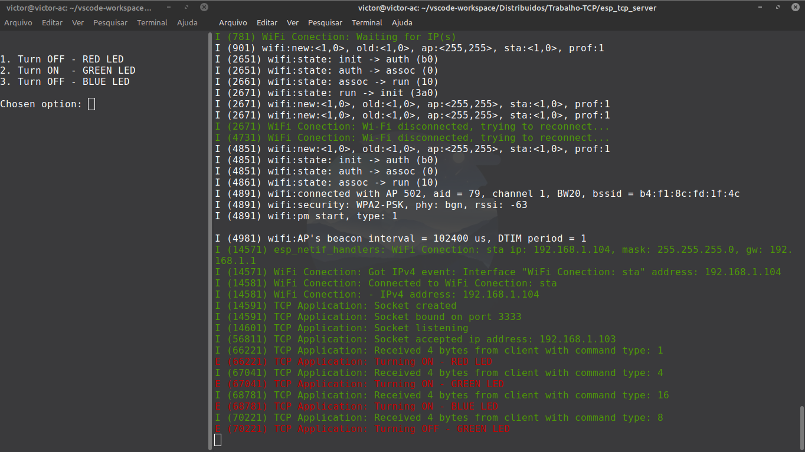
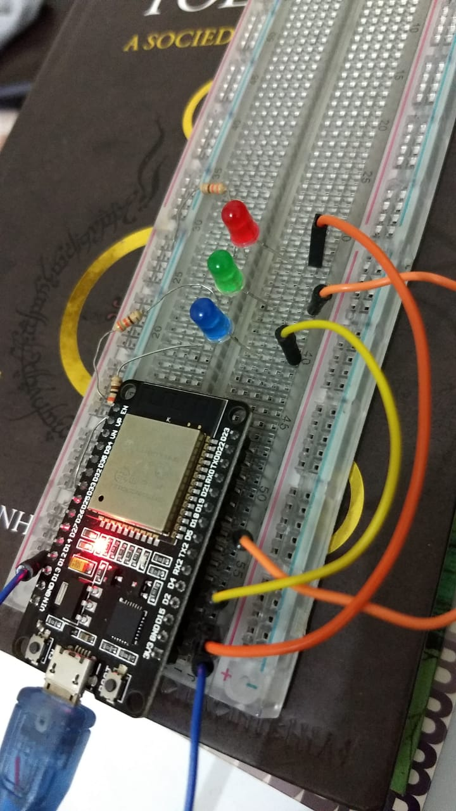
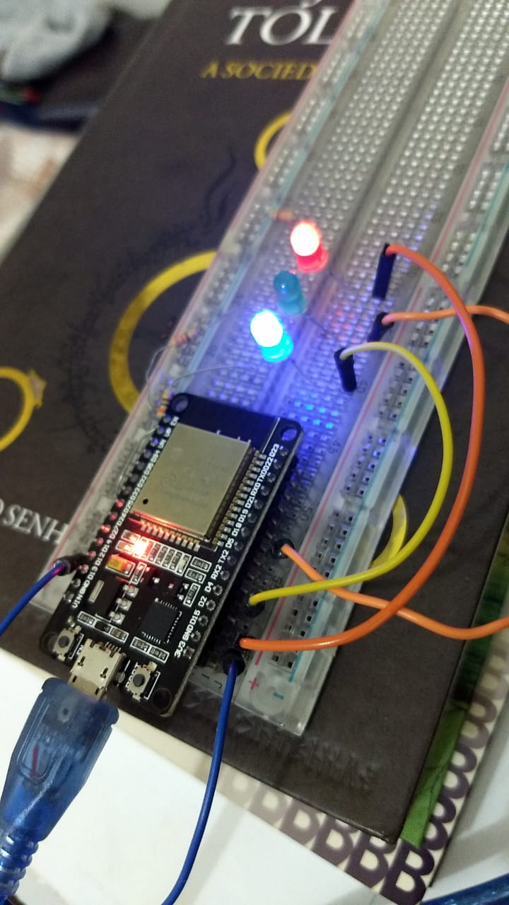

# ESP32 GPIO control with sockets

This application allows you to control your ESP32 GPIO state through sockets using a menu on the terminal.

## Requirements
For this application i'm using:
- **ESP32 DevKit v1**
- **3 LED's with 330 Ohm resistors**
- **ESP-IDF**


```bashrc
$ idf.py --version
ESP-IDF v4.2-dirty
```

## How to use
Run the ESP32 application to get an IP address:
```bashrc
I (11581) WiFi Conection: - IPv4 address: 192.168.1.104
```

In **folder** client at **tcp_client.c**, add the IP address here
```c
server.sin_addr.s_addr = inet_addr("YOUR-ESP-IP-ADDRESS");
```

So, just run **tcp_client.c** and have fun :)

## Images
Client side / Server side


Before send commands / After send commands
<div class="box">
  
  
</div>
